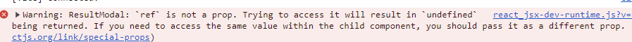

# Section8 : Refs & Portals


## 모달 컴포넌트: dialog 요소

공식문서: [https://developer.mozilla.org/ko/docs/Web/HTML/Element/dialog](https://developer.mozilla.org/ko/docs/Web/HTML/Element/dialog)

HTML `<dialog>요소`는 닫을 수 있는 경고, 검사기, 창 등 대화상자 및 기타 다른 상호작용 가능한 컴포넌트를 나타냅니다. 

- `method="dialog"` 특성을 사용한 [`<form>`](https://developer.mozilla.org/ko/docs/Web/HTML/Element/form) 요소는 제출 시 대화 상자를 닫습니다. 이 때, 대화 상자의 [`returnValue` (en-US)](https://developer.mozilla.org/en-US/docs/Web/API/HTMLDialogElement/returnValue) 속성은 양식을 제출할 때 사용한 버튼의 [`value`](https://developer.mozilla.org/ko/docs/Web/HTML/Element/button#value)으로 설정됩니다.
- `returnValue` : gets or sets the return value for the <dialog>,
    - `method="dialog"` 인 폼을 제출할 때 dialog를 닫고 `value` 에 반환 값을 세팅하는데 , 이때 button이나 input 요소가 `type=submit` 이어야 한다. 밑의 코드에서 `resetBtn` 은 returnValue에 아무런 영향을 주지않는다. 추가로 ESC 버튼도 아무런 영향을 주지 않는다.
    
    ```jsx
    <dialog id="favDialog">
      <form method="dialog">
        <input
          type="submit"
          aria-label="close"
          value="X"
          name="Xbutton"
          formnovalidate />
        <p>
          <label
            >Favorite animal:
            <select name="favAnimal" required>
              <option></option>
              <option>Brine shrimp</option>
              <option>Red panda</option>
              <option>Spider monkey</option>
            </select>
          </label>
        </p>
        <menu>
          <button type="reset" value="resetBtn">Reset</button>
          <button type="submit" value="confirmBtn">Confirm</button>
    //
        </menu>
      </form>
    </dialog>
    
    dialog.addEventListener("close", () => {
          openCheck(dialog);
          handleUserInput(dialog.returnValue);
    //
        });
      })();
    ```
    
- `<form method="dialog">` 는 dialog를 닫고 `value`에 반환 값을 셋팅한다.
- `::backdrop` 의사요소를 사용하면 HTMLElement.showModal() 메서드를 사용해 활성화한 요소의 뒤에 스타일을 적용할 수 있다.
    - [`showModal()`](https://developer.mozilla.org/en-US/docs/Web/API/HTMLDialogElement/showModal) : dialog를 modal처럼 보이도록 한다. top layer에 보여지고 backdrop 과 함께 보여진다. dialog 바깥의 상호작용은 블락됨.
        - exception: dialog가 이미 열려있다면 `invalidStateError.` 예를 들어 <dialog>에 `open` 속성이 있을 때.

### 커스텀 컴포넌트로 Refs 전달

dialog는 open으로 강제해 열면 backdrop이 되지 않는다.

- 이전코드
    
    **`ResultModal.jsx`**
    
    ```jsx
    import React, { useRef } from 'react'
    
    function ResultModal({result, targetTime}) {
      
      return (
        <dialog className="result-modal"  open >
          <h2>You {result}</h2>
          <p>The target time was <strong>{targetTime} seconds</strong></p>
          <p>You stopped the timer with <strong>X seconds left.</strong></p>
          <form method ="dialog">
            <button>Close</button>
          </form>
        </dialog>
      )
    }
    
    export default ResultModal
    ```
    
    `TimerChallenge.jsx`
    
    ```jsx
    import React from 'react'
    import {useState, useRef} from 'react'
    import ResultModal from './ResultModal';
    
    function TimerChallenge({title, targetTime}) {
    
      const timer= useRef();
      const [timerExpired, setTimerExpired]= useState(false)
      const [timerStarted,setTimerStarted]=useState(false)
    
      
      function handleStart(){
        timer.current= setTimeout(()=>{setTimerExpired(true)}, targetTime*1000)
        setTimerStarted(true)
      }
      function handleStop(){
        clearTimeout(timer.current)
        // setTimerStarted(false)
        // setTimerExpired(false)
      }
      return (
        <>
        {timerExpired &&<ResultModal targetTime={targetTime} result="lost"/>}
        <section className="challenge">
          <h2>{title}</h2>
          <p className="challenge-time">
            {targetTime} second {targetTime >1 ? 's': ''}
          </p>
          <p>
            <button onClick={timerStarted ? handleStop: handleStart}>
              {timerStarted ? 'stop': 'start'} Challenge
            </button>
          </p>
          <p className={timerStarted ? 'active': undefined}>
            {timerStarted ? 'Time is running ...': ' Timer inactive'}
          </p>
        </section>
        </>
      )
    }
    
    export default TimerChallenge
    ```
    

dialog를 브라우저에 명령을 보내는 방식으로 backdrop을 얻는다. ⇒ 참조를 이용한다. 

- 코드 수정

```jsx
import React from 'react'
import {useState, useRef} from 'react'
import ResultModal from './ResultModal';

function TimerChallenge({title, targetTime}) {
  const dialog= useRef();
  const timer= useRef();
  const [timerExpired, setTimerExpired]= useState(false)
  const [timerStarted,setTimerStarted]=useState(false)

  
  function handleStart(){
    timer.current= setTimeout(()=>{
      setTimerExpired(true)
      dialog.current.showModal()
    }, targetTime*1000)
    setTimerStarted(true)
  }
  function handleStop(){
    clearTimeout(timer.current)
  
  }
  return (
    <>
    {timerExpired &&<ResultModal **ref={dialog}** targetTime={targetTime} result="lost"/>}
    <section className="challenge">
      <h2>{title}</h2>
      <p className="challenge-time">
        {targetTime} second {targetTime >1 ? 's': ''}
      </p>
      <p>
        <button onClick={timerStarted ? handleStop: handleStart}>
          {timerStarted ? 'stop': 'start'} Challenge
        </button>
      </p>
      <p className={timerStarted ? 'active': undefined}>
        {timerStarted ? 'Time is running ...': ' Timer inactive'}
      </p>
    </section>
    </>
  )
}

export default TimerChallenge
```

```jsx
import React, { useRef } from 'react'

function ResultModal({**ref**, result, targetTime}) {
  
  return (
    <dialog **ref={ref}** className="result-modal" >
      <h2>You {result}</h2>
      <p>The target time was <strong>{targetTime} seconds</strong></p>
      <p>You stopped the timer with <strong>X seconds left.</strong></p>
      <form method ="dialog">
        <button>Close</button>
      </form>
    </dialog>
  )
}

export default ResultModal
```

에러 발생



ResultModal: `ref` is not a prop. Trying to access it will result in `undefined` being returned. If you need to access the same value within the child component, you should pass it as a different prop.

- 리액트에서는 일반적으로 사용할 수 없는 몇 가지 prop이 있는데 그 중 ref도 HTML Element 접근으로 일반적인 prop에 사용 불가 하다.
- ref를 prop으로 넘겨주려면 **`forwardRef`** 라는 함수를 사용해주어야 한다.
- 리액트 컴포넌트를 fowardRef()로 감싸주면 컴포넌트 함수는 2번째 매개변수를 갖게 되는데 이를 통해 ref prop을 넘길 수 있다.
- 첫 번째 매개변수는 props, 두 번째는 ref

- forwardRef 함수로 감싸주었다.

```jsx
import React, { forwardRef } from 'react'

const ResultModal=**forwardRef(**({result, targetTime},ref) => {
  
  return (
    <dialog ref={ref} className="result-modal" >
      <h2>You {result}</h2>
      <p>The target time was <strong>{targetTime} seconds</strong></p>
      <p>You stopped the timer with <strong>X seconds left.</strong></p>
      <form method ="dialog">
        <button>Close</button>
      </form>
    </dialog>
  )
}**)**

export default ResultModal
```

현 코드의 문제점은 TimerChallenge 컴포넌트에서 dialog ref에 대한 것을 알고 있어야 한다는 점이다.  

예를 들어 ResultModal의 `dialog` 를 `div` 로 바꾼다면 dialog.current.showModal()이 작동하지 않게 된다.

컴포넌트를 독립적으로 만들어줄 필요가 있다. 

웬만한 상황에서 쓰는 걸 권장하지 않음 → props를 쓸 것.

근데 이 상황에서는 컴포넌트의 재사용성을 높여주기 때문에 좋다.

보통 fowardRef와 함께 작업

[`useImperativeHandle(ref,()=>{return{ open(){}}})`](https://react-ko.dev/reference/react/useImperativeHandle)

- Call useImperativeHandle at the top level of your component to customize the ref handle it exposes
- 매개변수
    - `ref`: fowardRef 렌더 함수에서 두 번째 인자로 받은 ref
    - `createHandle:` 인자가 없고 노출하려는 ref 핸들을 반환하는 함수. 일반적으로 노출하려는 메서드가 있는 객체 반환.
- 반환값: undefined
- 예문
    
    ```jsx
    import { forwardRef } from 'react';
    
    const MyInput = forwardRef(function MyInput(props, ref) {
      return <input {...props} ref={ref} />;
    });
    
    ```
    
    위 코드에서 MyInput에 대한 ref는 `<input>` DOM 노드를 받게 되는데. useImperativeHandle을 통해 사용자 지정 값을 노출 시킬 수 있다.
    
    ```jsx
    import { forwardRef, useImperativeHandle } from 'react';
    
    const MyInput = forwardRef(function MyInput(props, ref) {
    	const inputRef= useRef(null);
    
      useImperativeHandle(ref, () => {
        return {
    // 노출시키고 싶은 메서드
          focus() {
            inputRef.current.focus();
          },
          scrollIntoView() {
            inputRef.current.scrollIntoView();
        };
      }, []);
    
      return <input {...props} ref={inputRef} />;
    });
    ```
    
    - 위 코드에서 더 이상 ref는 `<input>`으로 전달되지 않는다.
    - 예를 들어, `<input>` 노드를 다 노출시키고 싶지 않고 `focus` 와 `scrollIntoView` 만 노출 시키고 싶을 때. useImperativeHandle을 사용해 부모컴포넌트에게 노출시킬 메서드를 선택적으로 할 수 있다.
    - 부모 컴포넌트가 MyInput에 대한 ref를 가져오면 `focus`와 `scrollIntoview` 메서드 호출이 가능하다. 그러나 `<input>` DOM 노드의 전체 엑세스 권한은 없다.
    
    ```jsx
    import { useRef } from 'react';
    import Post from './Post.js';
    
    export default function Page() {
      const postRef = useRef(null);
    
      function handleClick() {
        postRef.current.scrollAndFocusAddComment();
      }
    
      return (
        <>
          <button onClick={handleClick}>
            Write a comment
          </button>
          <Post ref={postRef} />
        </>
      );
    }
    ```
    
    ```jsx
    import { forwardRef, useRef, useImperativeHandle } from 'react';
    import CommentList from './CommentList.js';
    import AddComment from './AddComment.js';
    
    const Post = forwardRef((props, ref) => {
      const commentsRef = useRef(null);
      const addCommentRef = useRef(null);
    
      useImperativeHandle(ref, () => {
        return {
          scrollAndFocusAddComment() {
            commentsRef.current.scrollToBottom();
            addCommentRef.current.focus();
          }
        };
      }, []);
    
      return (
        <>
          <article>
            <p>Welcome to my blog!</p>
          </article>
          <CommentList ref={commentsRef} />
          <AddComment ref={addCommentRef} />
        </>
      );
    });
    
    export default Post;
    ```
    
    - 위 처럼 imperative handle에서 노출하는 메서드는 DOM 메서드와 정확히 일치할 필요가 없다. 위처럼 복합적으로 사용 가능함
    - **prop으로 표현할 수 있는 것은 ref를 사용하지 마세요.** 예를 들어, `Modal` 컴포넌트에서 `{open, close}`와 같은 imperative handle을 노출하는 대신 `<Modal isOpen={isOpen} />`과 같은 `isOpen` prop을 사용하는 것이 더 좋습니다. [Effect](https://react-ko.dev/learn/synchronizing-with-effects)를 사용하면 prop을 통해 명령형 동작(imperative behavior)을 노출할 수 있습니다.

```jsx
import React, { forwardRef, useImperativeHandle, useRef } from 'react'

const ResultModal=forwardRef(function ResultModal({result, targetTime},ref)  {
  const dialog= useRef()

  useImperativeHandle(ref, ()=>{return{ **open()**{dialog.current.showModal()} }})

  return (
    <dialog ref={dialog} className="result-modal" >
      <h2>You {result}</h2>
      <p>The target time was <strong>{targetTime} seconds</strong></p>
      <p>You stopped the timer with <strong>X seconds left.</strong></p>
      <form method ="dialog">
        <button>Close</button>
      </form>
    </dialog>
  )
})

export default ResultModal
```

```jsx
import React from 'react'
import {useState, useRef} from 'react'
import ResultModal from './ResultModal';

function TimerChallenge({title, targetTime}) {
  const dialog= useRef();
  const timer= useRef();
  const [timerExpired, setTimerExpired]= useState(false)
  const [timerStarted,setTimerStarted]=useState(false)

  
  function handleStart(){
    timer.current= setTimeout(()=>{
      setTimerExpired(true);
      dialog.current.open();
    }, targetTime*1000)
    setTimerStarted(true)
  }
  function handleStop(){
    clearTimeout(timer.current)
    // setTimerStarted(false)
    // setTimerExpired(false)
  }
  return (
    <>
    <ResultModal ref={dialog} targetTime={targetTime} result="lost"/>
    <section className="challenge">
      <h2>{title}</h2>
      <p className="challenge-time">
        {targetTime} second {targetTime >1 ? 's': ''}
      </p>
      <p>
        <button onClick={timerStarted ? handleStop: handleStart}>
          {timerStarted ? 'stop': 'start'} Challenge
        </button>
      </p>
      <p className={timerStarted ? 'active': undefined}>
        {timerStarted ? 'Time is running ...': ' Timer inactive'}
      </p>
    </section>
    </>
  )
}

export default TimerChallenge
```

결론: fowardRef사용 → dialog에 ref를 전달하여 부모컴포넌트에서 dialog를 조작할 수 있도록한다 예를 들어 showModal() → useImperativeHandle을 사용하여 dialog 태그에 대한 이해 없이도 부모 컴포넌트에서 modal을 조작할 수 있도록. 객체 함수를 만들어준다고 생각.

## Portal 이해

모달의 경우 <body> 바로 밑으로 위치하는 게 있어야 더 직관적이다.

react-dom 라이브러리의 Portal을 사용하자.

`createPorrtal` 의 의미는 이 컴포넌트에 렌더링이될 HTML 코드를 DOM 내에 다른 곳으로 옮기는 것.

- index.html에 DOM의 위치를 정해두어 div태그로 id와 함께 작성해둔다.
- 첫 번째 인수는 JSX 코드
- 두 번째 인수는 HTML 요소 ⇒ 기본 브라우저 API로 선택해야 한다. `document.getElementById('modal')` 정해둔 위치의 div id를 적어 요소를 가져온다.

```jsx
import {createPortal} from 'react-dom'

const ResultModal=forwardRef(function ResultModal({targetTime,remainingTime,onReset},ref)  {
  const dialog= useRef()
  const userLost = remainingTime<=0  
  const formattedRemainingTime= (remainingTime/1000).toFixed(2)
  const score=Math.round((1- remainingTime /(targetTime*1000)) *100)

  useImperativeHandle(ref, ()=>{return{ open(){dialog.current.showModal()} }})

  return createPortal(
    <dialog ref={dialog} className="result-modal" onClose={onReset} >
      {userLost &&<h2>You lost </h2>}
      {!userLost &&<h2>Your score {score}</h2>}
      <p>The target time was <strong>{targetTime} seconds</strong></p>
      <p>You stopped the timer with <strong>{formattedRemainingTime} seconds left.</strong></p>
      <form method ="dialog" onSubmit={onReset}>
        <button>Close</button>
      </form>
    </dialog>,
    document.getElementById('modal')
);})

```